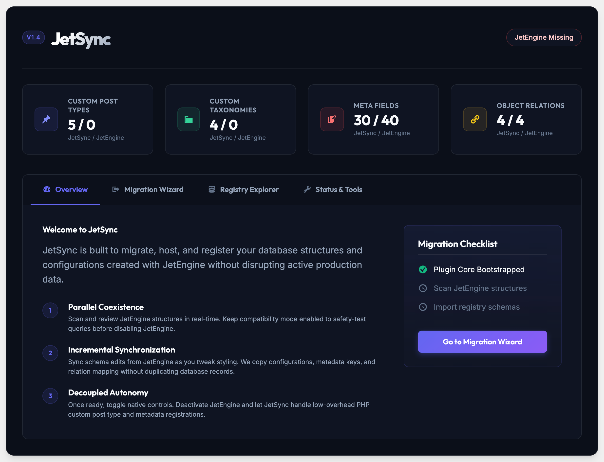

# JetSync

> Professional JetEngine successor for WordPress: migrate, host, and manage Custom Post Types, Taxonomies, Meta Fields, Relations, and Listings — without disrupting production data.



## What is JetSync?

JetSync is an enterprise-grade WordPress plugin designed as a clean, independent alternative to JetEngine. It detects structures created with JetEngine, imports them into its own versioned registry, and takes over native registration — so you can eventually deactivate JetEngine with zero data loss.

Core promise: **clone definitions, keep WordPress objects**. Posts, terms, post meta, featured images, authors, and statuses stay intact. Only the configuration layer moves.

## Key capabilities

- **Custom Post Types** — detect, clone, edit, and natively register (`register_post_type`)
- **Custom Taxonomies** — labels, rewrite, hierarchical flags, object-type mapping
- **Meta Boxes / Meta Fields** — neutral internal schema, compatible meta keys, runtime save/load
- **Object Relations** — post-to-post and related mappings with dedicated storage, integrity checker, and `get_related_items` / `set_related_items` API
- **Listings Engine (MVP)** — query source, field mapping, loop rendering, `[jetsync_listing]` shortcode, Gutenberg block foundation
- **Migration Center** — scan, full import, incremental sync, dry-run, reports, rollback points
- **Readiness Checklist** — validates what is migrated, what still depends on JetEngine, and when it is safe to deactivate

## Migration workflow

1. **Parallel Coexistence** — run JetSync alongside JetEngine. Scan structures in real time, keep compatibility mode on.
2. **Incremental Synchronization** — sync schema edits (configurations, meta keys, relation mappings) without duplicating records.
3. **Decoupled Autonomy** — run validations, confirm readiness, deactivate JetEngine. JetSync handles CPT, taxonomy, and metadata registration natively with low overhead.

Admin path: **JetSync → Overview → Migration Wizard → Registry Explorer → Status & Tools** (re-sync, validate, repair, export/import, relation rebuild, cache clear).

## Requirements

- WordPress 6.0+
- PHP 8.1+
- Optional: JetEngine (active, only during import), Elementor (dynamic tags / loop grid bridge), Gutenberg

## Installation

1. Upload the plugin folder to `/wp-content/plugins/jetsync`
2. Activate via **Plugins → JetSync**
3. Open **JetSync → Overview**, then run the **Migration Wizard**

## Architecture

Modular, OOP, namespaced, PSR-4-style autoloading:

```
jet-sync.php
src/
  Core/            bootstrap, autoloader, installer, capabilities, logger
  Compatibility/   JetEngine detector + import adapters (CPT, taxonomy, fields, relations)
  Registry/        internal versioned store for types, taxonomies, fields, relations, listings
  Runtime/         native registration, meta handling, relations engine, listing renderer
  Migration/       scan, plan, runner, integrity checker, export/import
  Admin/           dashboard, wizard, CRUD screens, tools
  Integration/     Elementor dynamic tags, loop integration, Gutenberg bridge
uninstall.php
```

Storage: `wp_options` for definitions, custom tables only where justified (relations, internal config), standard `postmeta` / `termmeta` wherever possible.

## Security & quality

Nonces, capability checks, sanitization/escaping throughout. No destructive operation without explicit confirmation. Nothing is deleted from JetEngine automatically. Uninstall behavior is explicit and conservative.

## Screenshot

Dashboard preview (`assets/images/screenshot-dashboard.png`): JetSync v1.4 overview with CPT / taxonomy / meta / relation counters, Migration Wizard entry, and Migration Checklist.

> Note: save the dashboard screenshot as `assets/images/screenshot-dashboard.png` to render it above on the GitHub homepage.

## License

GPL-2.0-or-later. See plugin header in `jet-sync.php`.
